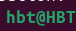

# Chimera_clone

# Environment Setup on Ubuntu 24.04 LTS

This guide describes how to set up a bioinformatics environment on **Ubuntu 24.04 LTS** for protein database analysis and *in silico* biosensor design (e.g., nanoCLAMP-linker-CaM-BP). It includes tools like Python, Biopython, Rosetta, PyMOL, ESM-2, and Snakemake, with an automated `setup.sh` script to install dependencies.

## Prerequisites

- **Operating System**: Ubuntu 24.04 LTS.
- **Hardware**: Minimum 4GB RAM, 20GB disk space (50GB+ recommended for Rosetta/AlphaFold).
- **Internet**: Required for downloading packages and tools.
- **Permissions**: Sudo access for installing system packages.
- **Optional**: NVIDIA GPU for ESM-2 or AlphaFold (CUDA setup included).

## Dependencies

The environment includes:

- **System Tools**: `build-essential`, `git`, `wget`, `curl`, `unzip`.
- **Python**: Python 3.9 (via Conda, as Ubuntu 24.04 defaults to Python 3.12), pip, Conda (Miniconda).
- **Python Libraries**: Biopython, NumPy, Pandas, Matplotlib, Seaborn, Jupyter, Transformers, DeepChem.
- **Bioinformatics Tools**: HMMER, MUSCLE, PyMOL, Rosetta, Snakemake.
- **Optional**: AutoDock Vina, GROMACS, AlphaFold2, CUDA (for GPU).

## Installation Steps

### Option 1: Automated Setup with `setup.sh`

1. Clone or download this repository:

   ```bash
   git clone <repository-url>
   cd <repository-directory>
   ```

2. Make the setup script executable:

   ```bash
   chmod +x setup.sh
   ```

3. Run the script:

   ```bash
   ./setup.sh
   ```

4. Follow prompts to accept licenses (e.g., Miniconda) and provide Rosetta license details (see below).

### Option 2: Manual Installation

If you prefer manual setup or encounter issues, follow these steps:

1. **Update System**:

   ```bash
   sudo apt update
   sudo apt upgrade -y
   sudo apt install -y build-essential git wget curl unzip libgl1-mesa-glx libegl1
   ```

2. **Install Miniconda**:

   ```bash
   wget https://repo.anaconda.com/miniconda/Miniconda3-latest-Linux-x86_64.sh
   bash Miniconda3-latest-Linux-x86_64.sh
   source ~/.bashrc
   conda config --add channels defaults
   conda config --add channels bioconda
   conda config --add channels conda-forge
   conda config --add channels phenix-project
   conda config --add channels https://conda.rosettacommons.org
   conda update -y conda
   ```

3. **Create Conda Environment**:

   ```bash
   conda create -n chimera_clone python=3.9
   conda activate chimera_clone
   ```

Note: the following steps should be executed within `chimera_clone` environment, in which the user@host section should look like this: , instead of .

4. **Install Python Libraries**:

   ```bash
   conda install -y numpy pandas scipy matplotlib seaborn jupyter
   pip install biopython transformers torch deepchem
   ```

5. **Install Bioinformatics Tools**:

   ```bash
   conda install -y hmmer muscle pymol-open-source snakemake
   sudo apt install -y autodock-vina
   conda install -y gromacs
   conda install alphafold
   ```

6. **Install Rosetta**:

   - Register for a free academic license at RosettaCommons.

   - Download the binary (e.g., `rosetta_bin_ubuntu_3.14_bundle.tar.bz2 `) from this [link](https://downloads.rosettacommons.org/downloads/academic/3.14/) and install:

     ```bash
     tar -xjf rosetta_bin_ubuntu_3.14_bundle.tar.bz2 
     sudo mv rosetta_bin_ubuntu_3.14_bundle.tar.bz2  /opt/rosetta
     echo 'export PATH=/opt/rosetta/main/source/bin:$PATH' >> ~/.bashrc
     source ~/.bashrc
     ```

7. **Optional: GPU Setup (CUDA)**:

   - Check GPU: `lspci | grep -i nvidia`.

   - Install CUDA:

     ```bash
     sudo apt install -y nvidia-driver-550 nvidia-cuda-toolkit
     pip install torch --index-url https://download.pytorch.org/whl/cu121
     ```

## Usage

1. **Activate Environment**:

   ```bash
   conda activate chimera_clone
   ```

2. **Test Setup**:

   - Verify Biopython:

     ```bash
     python -c "import Bio; print('Biopython:', Bio.__version__)"
     ```

   - Open PyMOL:

     ```bash
     pymol
     ```

   - Test Rosetta:

     ```bash
     rosetta_scripts.static.linuxgccrelease -help
     ```

   - Compile Rosetta:
      ```bash
      cd /opt/rosetta/main/source 
      ./scons.py -j 32 mode=release bin
      ```

3. **Run a Sample Analysis**:

   - Query UniProt for calmodulin (P0DP23):

     ```python
     from Bio import ExPASy, SwissProt
     handle = ExPASy.get_sprot_raw("P0DP23")
     record = SwissProt.read(handle)
     print(record.description, record.sequence)
     ```

## Troubleshooting

- **Conda Not Found**: Run `source ~/miniconda3/bin/activate` or restart the terminal.
- **Permission Errors**: Ensure sudo access or use `chmod +x` for scripts.
- **Rosetta License**: Register at RosettaCommons for a free academic license.
- **GPU Issues**: Verify CUDA with `nvidia-smi`. Reinstall drivers if needed.
- **Library Conflicts**: Create a new Conda environment or use Docker (see below).
- **Ubuntu 24.04 Issues**: If packages fail, check Ubuntu’s updated repositories (`sudo apt update`).

4. **Docker Setup**

For a fully reproducible environment:

```bash
sudo apt install -y docker.io
sudo usermod -aG docker $USER
newgrp docker
```
We shall go back to `chimera_clone` environment to copy it environment configurations to `docker`. Docker build scripts for `chimera_clone`
```bash
conda activate chimera_clone
conda export > environment.yml
docker build -t chimera_clone -f docker/Dockerfile .
```

Run this script so that output generated in the `Docker` will be transferred to host OS's corresponding directory.
```bash
docker run -v $(pwd)/data:/app/data chimera_clone
``` 

## Project Context

This setup supports:

- **Protein Database Analysis**: Query UniProt/PDB for proteins like nanoCLAMP and CaM-BP (calmodulin-binding domain, CBD).
- **Function Inference**: Use ESM-2 for sequence-based predictions, Rosetta for structural modeling.
- **Biosensor Design**: Engineer chimeras (e.g., nanoCLAMP-linker-CaM-BP) for calcium or analyte detection with Rosetta, AutoDock, and GROMACS.

For questions, open an issue in the repository or contact \[tqmthong@gmail.com\].
